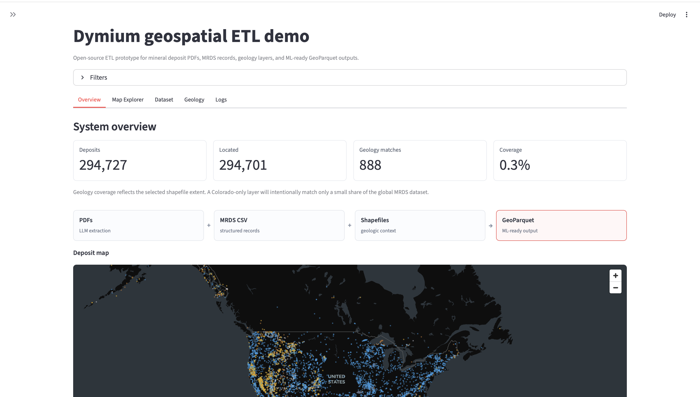
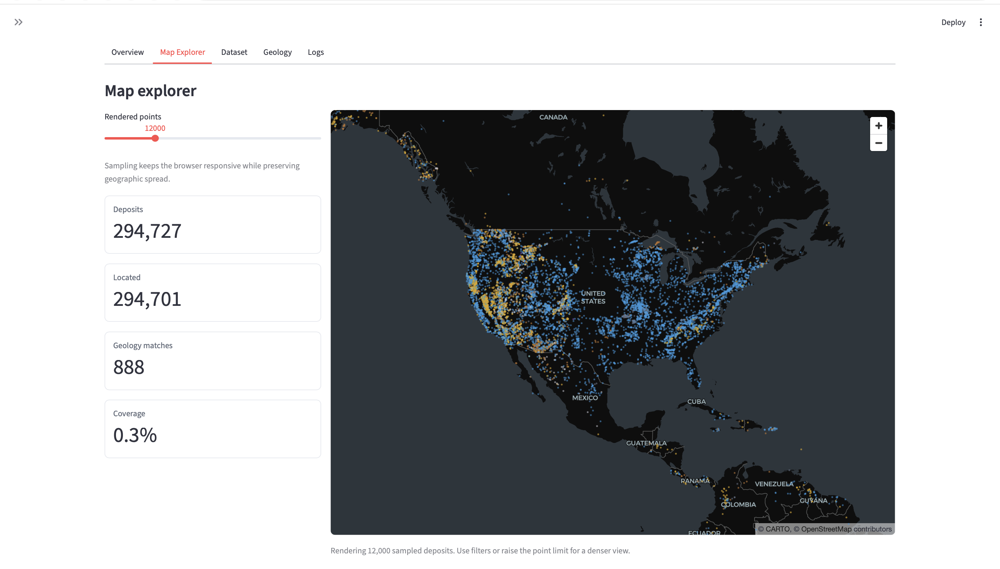
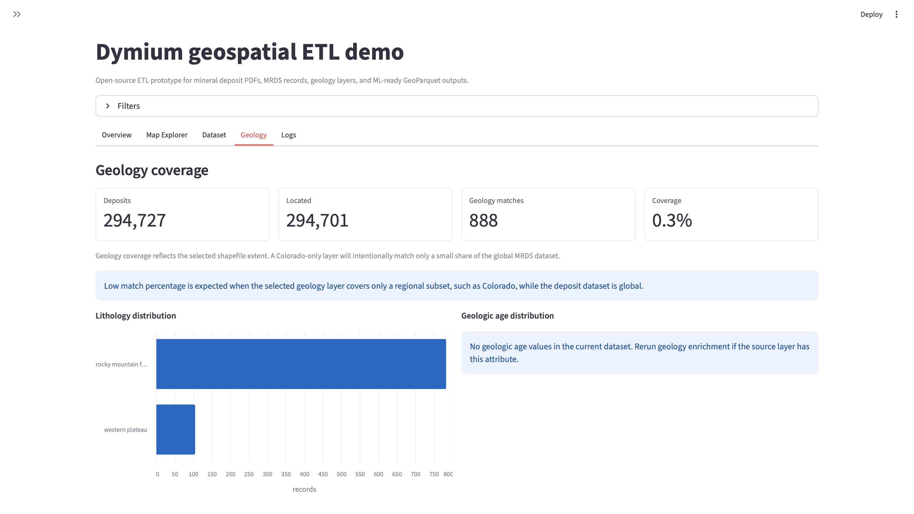

# Dymium
Open-source geospatial ETL infrastructure for transforming fragmented geological data into structured, ML-ready datasets.

Dymium ingests geological PDFs, mineral databases, shapefiles, and geospatial layers, then normalizes them into a unified schema and exports GeoParquet datasets for downstream machine learning, exploration analysis, and geoscience workflows.

## Why Dymium Exists

Geological data is abundant but operationally fragmented.

Mineral deposit information is spread across:
- scanned PDF reports,
- legacy tabular databases,
- inconsistent geospatial formats,
- jurisdiction-specific schemas,
- decades of unstructured technical documents.

This fragmentation creates a major bottleneck for machine learning, spatial analysis, and downstream exploration workflows.

Dymium focuses on solving the data standardization layer first:
- extract structured entities from geological documents,
- normalize schemas across sources,
- spatially enrich deposits with geological context,
- export interoperable GeoParquet datasets.

## Overview
Dymium converts heterogeneous geological data--PDF reports, CSV datasets, and shapefiles--into a unified, standardized format suitable for machine learning and analysis. Geological data is abundant but fragmented across formats, schemas, and decades of inconsistent reporting. Most of it is locked in PDFs, legacy databases, or incompatible geospatial files. Dymium focuses on solving this bottleneck by automating:
- PDF text extraction and entity recognition
- MRDS schema normalization
- Cross-source dataset fusion
- Spatial geologic enrichment

The result is a clean, consistent baseline dataset that can be extended and refined for downstream modeling.

## Architecture

```text
PDF Reports -+
MRDS CSVs ---+--> Ingestion & Parsing --> Entity Extraction --> Schema Normalization --> GeoParquet
Shapefiles --+            |                        |
                          |                        +--> Spatial Enrichment
                          |
                          +--> Streamlit Visualization Layer
```

## Demo UI

### Pipeline Overview


### Deposit Map


### Geology Enrichment


## Before and After Transformation

The example below uses project artifacts generated from the local development data:

- `test_docs/minerals-10-00965-v3.pdf`
- `rdbms-tab/MRDS.txt`
- `geological_data/colorado_geology.shp`
- `out/unified.parquet`
- `out/enriched.parquet`
- `docs/images/deposit-map.png`

```text
Geological PDF + MRDS TXT + geology shapefile
        |
        v
PDF text/entity extraction + MRDS normalization
        |
        v
MRDS/PDF fusion into GeoParquet
        |
        v
Spatial geology join + Streamlit visualization
```

### Raw Input Examples

PDF text extracted from `test_docs/minerals-10-00965-v3.pdf` begins with:

```text
minerals Review
Carbonatite-Related REE Deposits: An Overview
...
Abstract: The rare earth elements (REEs) ...
```

For this PDF, `src.etl.pdf_ingest.extract_text_from_pdf` produced 89,411 extracted characters and 16 text chunks before LLM entity extraction.

MRDS source row from `rdbms-tab/MRDS.txt`:

```tsv
i	dep_id	name	dev_stat	url	code_list	longitude	latitude
1	10000013	"Moonshine Prospect"	"Occurrence"	"https://mrdata.usgs.gov/mrds/show-mrds.php?dep_id=10000013"	" AU CU "	-132.05371	55.14445
```

Raw geology attributes from `geological_data/colorado_geology.shp`:

| name | age | type |
| --- | --- | --- |
| Rocky Mountain Front | Precambrian | Metamorphic |
| Western Plateau | Paleozoic | Sedimentary |

### Extracted and Normalized Records

The MRDS row above is normalized into explicit schema fields and expanded commodity names:

```json
{
  "record_id": "10000013",
  "site_name": "Moonshine Prospect",
  "development_status": "Occurrence",
  "latitude": 55.14445,
  "longitude": -132.05371,
  "commodity_codes": ["AU", "CU"],
  "commodities": ["gold", "copper"]
}
```

A real PDF-derived record from `out/unified.parquet` shows how the pipeline preserves partial extraction results when location evidence is missing:

```json
{
  "record_id": "pdf-fbfb17cd557038b0",
  "site_name": "Bayan Obo REE-Nb-Fe deposit",
  "latitude": null,
  "longitude": null,
  "commodities": ["rare earth elements", "niobium", "iron"],
  "source": "pdf",
  "confidence_score": 0.6,
  "geometry": null
}
```

### Final Standardized Output

`out/unified.parquet` currently contains 294,727 fused records:

| source | rows |
| --- | ---: |
| `mrds` | 294,698 |
| `pdf` | 26 |
| `mrds+pdf` | 3 |

After geology enrichment with `geological_data/colorado_geology.shp`, the pipeline writes `out/enriched.parquet`. A real enriched GeoParquet row:

```json
{
  "record_id": "10018057",
  "site_name": "Mill Site, Overland",
  "latitude": 40.13692,
  "longitude": -105.41726,
  "commodities": ["gold"],
  "source": "mrds",
  "confidence_score": 1.0,
  "geologic_unit": "Rocky Mountain Front",
  "lithology": "Metamorphic",
  "geologic_age": "Precambrian",
  "geometry": "POINT (-105.41726 40.13692)"
}
```

### Final Visualization

The Streamlit demo renders the standardized GeoParquet output as an interactive deposit map:


## Uncertainty and Failure Handling

Dymium currently surfaces uncertainty through explicit fields, null values, validation warnings, and coverage metrics. It does not yet provide OCR confidence because the current PDF path uses PyMuPDF text extraction rather than a full OCR engine.

Real examples from the current artifacts:

| Signal | Real example | How it is handled |
| --- | --- | --- |
| Lower-confidence PDF extraction | `Bayan Obo REE-Nb-Fe deposit` has `confidence_score: 0.6` | The record is retained, but its lower score distinguishes it from validated MRDS rows. |
| Missing PDF coordinates | 26 PDF-only rows have no geometry in `out/enriched.parquet` | `latitude`, `longitude`, and `geometry` remain null, so these records are excluded from point rendering and spatial joins. |
| Partial geology coverage | Colorado geology enrichment matched 888 of 294,727 records, or 0.3% | Unmatched records keep null `geologic_unit`, `lithology`, and `geologic_age`; the Streamlit UI warns that regional layers intentionally cover only part of the global dataset. |
| Coordinate validation | `tests/sanity_check_unified.py out/unified.parquet` reports 0 invalid coordinate rows | Invalid MRDS coordinates are dropped during ingestion; downstream sanity checks verify the exported geometry. |
| Incomplete metadata | Many MRDS rows have null `grade` and `tonnage` | The schema preserves nulls rather than filling unsupported values. |

This is intentionally conservative: Dymium prefers incomplete but traceable records over fabricated precision.

## Example Use Cases
- Rapid integration of historical geological datasets
- Preparing training data for mineral exploration models
- Standardizing datasets across multiple jurisdictions
- Reducing manual data wrangling in mining workflows
- Enabling downstream ML/AI pipelines


## Tech Stack
- Python 3.11+
- PyMuPDF (PDF parsing)
- OpenAI structured JSON extraction
- Pandas / GeoPandas / Shapely
- Pydantic (schema validation)
- GeoParquet / PyArrow
- Streamlit / PyDeck (demo UI)

## Getting Started
```bash
git clone https://github.com/<your-username>/Dymium.git
cd Dymium
python -m venv .venv
source .venv/bin/activate
pip install -r requirements.txt
```

Set `OPENAI_API_KEY` before running PDF extraction or full MRDS/PDF fusion.

## MRDS CSV Ingestion
Normalize the USGS MRDS tabular export and write a GeoParquet dataset:
```bash
python -m src.etl.ingest_mrds rdbms-tab/MRDS.txt --output out/mrds.parquet
```

The same module can be called from a pipeline or Lambda handler:
```python
from src.etl.ingest_mrds import process_mrds

process_mrds("/tmp/MRDS.txt", "/tmp/mrds.parquet")
```

## PDF Report Ingestion
Extract mineral deposit records from geological PDF reports with PyMuPDF and OpenAI structured JSON output:
```bash
export OPENAI_API_KEY=...
python -m src.etl.pdf_ingest --input test_docs/minerals-10-00965-v3.pdf
```

Programmatic use:
```python
from src.etl.pdf_ingest import process_pdf

deposits = process_pdf("/tmp/report.pdf")
```
## Unified Dataset Fusion
Merge normalized MRDS records with PDF-extracted deposits and export a single GeoParquet dataset:
```bash
python -m src.etl.fusion --csv rdbms-tab/MRDS.txt --pdf test_docs/minerals-10-00965-v3.pdf --output out/unified.parquet
```

Programmatic use:
```python
from src.etl.fusion import build_unified_dataset

unified = build_unified_dataset("rdbms-tab/MRDS.txt", "test_docs/minerals-10-00965-v3.pdf")
```

## Geology Enrichment
Enrich the unified dataset with SGMC-style geologic-unit context using spatial joins:

```bash
python -m src.etl.geology --input out/unified.parquet --shapefile geological_data/colorado_geology.shp --output out/enriched.parquet
```

Programmatic use:
```python
from src.etl.geology import enrich_with_geology

enriched = enrich_with_geology("out/unified.parquet", "geological_data/colorado_geology.shp")
```

## Streamlit Demo
Run the local technical demo for PDF extraction, MRDS/PDF fusion, geology enrichment, map exploration, filtering, and GeoParquet downloads.

```bash
python -m venv .venv
source .venv/bin/activate
pip install -r requirements.txt
python -m streamlit run app.py
```

The demo reads existing outputs such as `out/unified.parquet` and `out/enriched.parquet` when present, and can also trigger the pipeline from the sidebar. Set `OPENAI_API_KEY` before running PDF extraction or dataset fusion.

## Standardized Output

Dymium exports normalized geospatial datasets with fields such as:

- `site_name`
- `commodities`
- `latitude` / `longitude`
- `lithology`
- `geologic_age`
- `source_url`
- `confidence_score`
- `geometry`

Outputs are written to GeoParquet for interoperability with:

- GeoPandas
- DuckDB
- Spark
- QGIS
- modern geospatial lakehouse workflows

## Project Status

Dymium is currently an early-stage open-source prototype.

### Current Capabilities
- MRDS CSV ingestion and normalization
- PDF mineral deposit extraction
- Multi-source dataset fusion
- Spatial geology enrichment
- GeoParquet export
- Interactive Streamlit demo UI

### In Progress
- Improved extraction confidence scoring
- Expanded lithology normalization
- GeoPackage support
- Logging and observability
- Containerized deployment

## Roadmap
- Robust PDF + OCR pipeline
- Improved LLM-based structured extraction
- Broader geoscience schema normalization
- Performance benchmarking against manual workflows
- Cloud-ready deployment patterns


## Scope

Dymium focuses on demonstrating:
- Multi-source ingestion
- Structured extraction from unstructured data
- Baseline schema alignment

It does not attempt to fully solve:
- Domain-specific geological ontologies
- High-precision geometallurgical interpretation
- Production-grade data pipelines

**Design Philosophy**
By focusing on data standardization first, Dymium aims to unlock downstream applications in exploration, processing, and decision-making.
Contributions are welcome.

Areas of interest:

  Geoscience schema design
  NLP for technical documents
  Geospatial data processing
  Data validation and QA pipelines


Apache 2.0 License

**Disclaimer**
This project is an experimental prototype intended for research and development purposes. Accuracy of extracted geological data may vary depending on source quality.

Contact
For collaboration or questions, open an issue or reach out.
